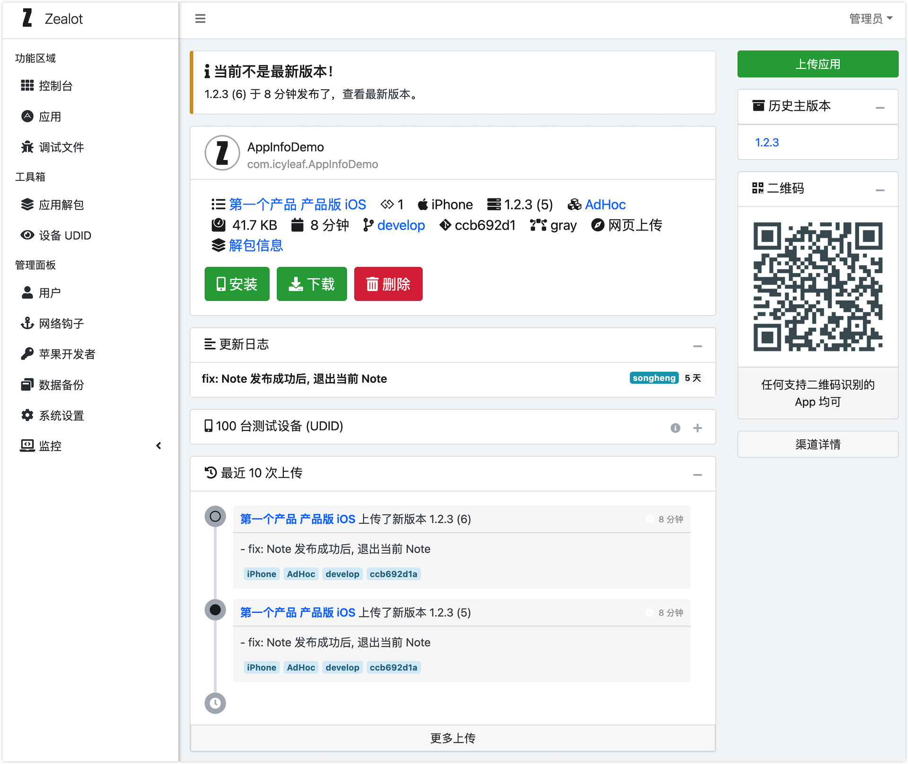

# Zealot

<a class="github-button" href="https://github.com/tryzealot/zealot" data-icon="octicon-star" data-size="large" data-show-count="true" aria-label="Star tryzealot/zealot on GitHub">加星</a>
<a class="github-button" href="https://github.com/tryzealot/zealot/subscription" data-icon="octicon-eye" data-size="large" data-show-count="true" aria-label="Watch tryzealot/zealot on GitHub">关注</a>
<a class="github-button" href="https://github.com/tryzealot/zealot/fork" data-icon="octicon-repo-forked" data-size="large" data-show-count="true" aria-label="Fork tryzealot/zealot on GitHub">分叉</a>
<a class="github-button" href="https://github.com/icyleaf" data-size="large" data-show-count="true" aria-label="Follow @icyleaf on GitHub">关注 @icyleaf</a>

开源自部署持续集成一切跟应用有关事情，接入任意 CI 系统一切自动化处理，企业多年实战经验，独立部署提供企业打包分发流程、上传应用全套流程方案 En Taro Adun! 🖖

## 特性

- [x] 支持 iOS、Android (apk/aab) 和 macOS 应用的上传、在线安装和本地下载
- [x] 自定义网络钩子通知各种服务（譬如钉钉、企业微信、Slack 等）
- [x] 多类型（Debug、AdHoc、Release）及渠道（应用商店等）管理
- [x] iOS dSYM 和 Android Progruard 文件的解析和存储
- [x] 应用解包（甚至 mobileprovision 文件）存储和分享
- [x] 检查新版本和安装服务的 iOS 和 Android SDK 组件
- [x] 获取 iOS 设备 UDID 显示支持安装的应用列表
- [x] 飞书、Gitlab、Google 和 LDAP 一键登录
- [x] 托管苹果开发者智能注册 iOS 测试设备
- [x] 持续构建的 fastlane 插件 [zealot](https://github.com/tryzealot/fastlane-plugin-zealot)
- [x] Gitlab 服务直接挂钩源码管理
- [ ] Jenkins 服务实现远程构建
- [x] 丰富的 REST APIs
- [ ] GraphQL 接口
- [x] 黑暗模式

## 在线演示

- 演示地址：https://tryzealot.herokuapp.com/
- 电子邮箱: `admin@zealot.com`
- 登录密码：`ze@l0t`

> **注意**: 数据每日都会重新初始化，不对用户上传的应用承担任何法律风险，后果自负！
