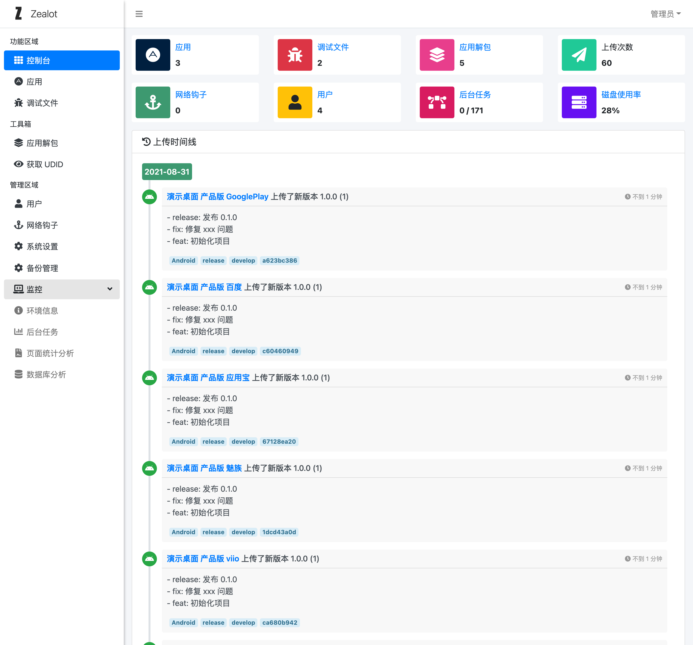

# Zealot

<a class="github-button" href="https://github.com/tryzealot/zealot" data-icon="octicon-star" data-size="large" data-show-count="true" aria-label="Star tryzealot/zealot on GitHub">Star</a>
<a class="github-button" href="https://github.com/tryzealot/zealot/subscription" data-icon="octicon-eye" data-size="large" data-show-count="true" aria-label="Watch tryzealot/zealot on GitHub">Watch</a>
<a class="github-button" href="https://github.com/tryzealot/zealot/fork" data-icon="octicon-repo-forked" data-size="large" data-show-count="true" aria-label="Fork tryzealot/zealot on GitHub">Fork</a>
<a class="github-button" href="https://github.com/icyleaf" data-size="large" data-show-count="true" aria-label="Follow @icyleaf on GitHub">Follow @icyleaf</a>

移动应用上传下载竟然如此简单、解放开发打包的烦恼，轻松放权给测试、产品、运营等使用 App 的人员，深度与 Jenkins 和 Gitlab 集成。

## 特性

- [x] 支持 iOS 和 Android 应用的上传和下载
- [x] 支持应用创建各种类型（Debug、AdHoc、Enterprise、Release）和渠道（小米、华为、Oppp、Vivo、应用宝等）
- [x] 支持 iOS dSYM 和 Android Progruard 文件的备份管理和解析
- [x] 支持单次上传解析 iOS、Android 包甚至是 mobileprovision 文件的信息
- [x] 支持自定义网络钩子（WebHooks）发送给通知各种服务（钉钉、企业微信、Slack 等）
- [x] 支持获取 iOS 设备 UDID 及显示支持安装的应用
- [x] 支持 OAuth 认证登录（目前以接入 Google，LDAP）
- [x] 提供检查新版本和安装服务的 iOS 和 Android 组件
- [x] 提供 fastlane 插件 [zealot](https://github.com/tryzealot/fastlane-plugin-zealot) 提供上传应用和调试文件服务
- [x] 可接入 Gitlab 服务直接挂钩源码管理
- [ ] 可接入 Jenkins 服务实现远程构建
- [x] 支持丰富的 REST APIs
- [x] 支持 [Docker 一键部署](https://github.com/tryzealot/zealot-docker)
- [ ] 支持 GraphGL 接口

## 演示

- 演示地址：https://tryzealot.ews.im/
- 电子邮箱: `admin@zealot.com`
- 登录密码：`ze@l0t`

> **注意**: 演示服务的数据每日都会重新初始化，请勿上传重要数据！
