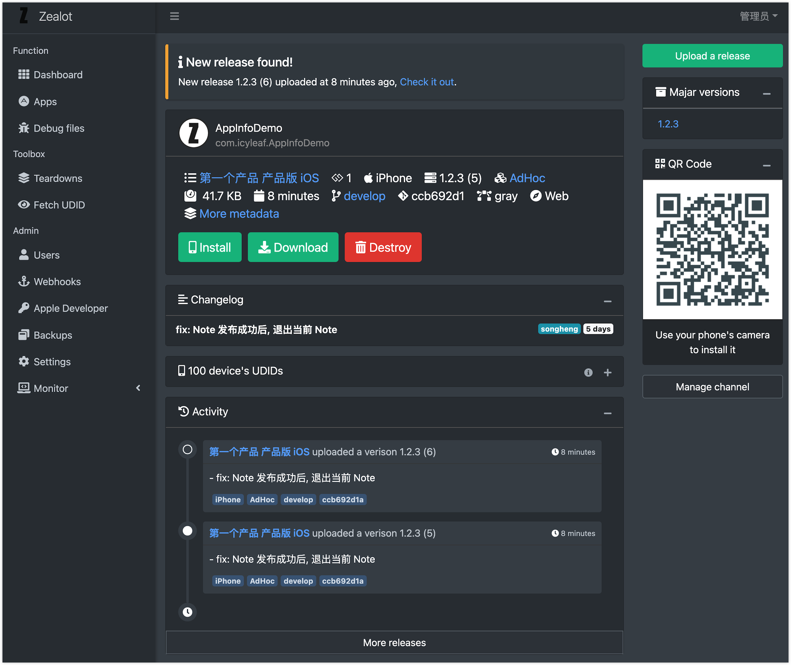

# Zealot

<a class="github-button" href="https://github.com/tryzealot/zealot" data-icon="octicon-star" data-size="large" data-show-count="true" aria-label="Star tryzealot/zealot on GitHub">Star</a>
<a class="github-button" href="https://github.com/tryzealot/zealot/subscription" data-icon="octicon-eye" data-size="large" data-show-count="true" aria-label="Watch tryzealot/zealot on GitHub">Watch</a>
<a class="github-button" href="https://github.com/tryzealot/zealot/fork" data-icon="octicon-repo-forked" data-size="large" data-show-count="true" aria-label="Fork tryzealot/zealot on GitHub">Fork</a>
<a class="github-button" href="https://github.com/icyleaf" data-size="large" data-show-count="true" aria-label="Follow @icyleaf on GitHub">Follow @icyleaf</a>

## Features

- [x] iOS, Android (apk, aab) and macOS app upload/install/download support.
- [x] Built-in 2 levels of app layer.
- [x] Webhook support (Slack, Dingtalk, Wecom etc)
- [x] Parsse and store iOS dSYM, Android Progruard.
- [x] Teardown suppored app file above (even mobileprovision file).
- [x] Third-party auth (Avaiables in Gitlab, Google, Feishu and LDAP)
- [x] Developer SDKs for iOS and Android
- [x] Easy fetch iOS UDID and feedback which app can install.
- [x] Fastlane plugins (like [zealot](https://github.com/tryzealot/fastlane-plugin-zealot)) support.
- [x] Gitlab Integration.
- [ ] Jenkins Integration (On processing)
- [x] REST APIs support.
- [ ] GraphQL APIs is comming.

## Demo

Simplified Chinese by default, change the locale in Setting page of Admin panel.

- URL：https://tryzealot.herokuapp.com/
- Admin account: `admin@zealot.com`
- Password: `ze@l0t`

> **Notification**: Clear and reset ALL DATA daily.

## About the translation

Power by [DeepL](https://www.deepl.com/translator) and The translation will inevitably have some defects, please provide feedback in time, thanks!
