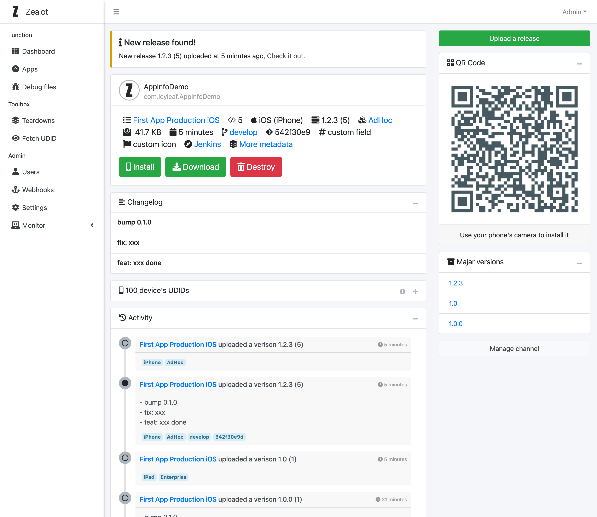

# Screenshots

Zealot is built using a responsive web front-end framework that adapts to the interface style on computers, tablets and mobile devices.

The following are screenshots of some key features:

### Dashboard page

### Release of app page

### App page

### Debug file page

### Teardown app page

### Fetch iOS UDID page

### Setting page

### System information page

